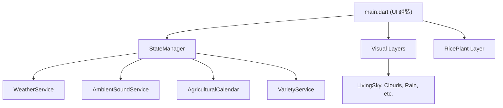

# 粒粒皆辛苦 (Rice Journey)

「一年一田、一季一冊」—— 這是一個真實、安靜、陪伴的台灣在地水稻文化 App。沒有廣告，沒有體力值，只有隨時間與真實天氣變化的稻田。  
[](https://codinguniversefromeric.bobaboba.me)
## 技術棧 (Tech Stack)

- **Framework**: Flutter
- **State Management**: 原生 `setState` + `ChangeNotifier` (於 `StateManager` 協調)
- **硬體與外部服務**:
  - `geolocator`: 獲取定位以判斷南北部節氣與品種
  - `just_audio`: 環境音效播放
  - **天氣 API**: 雙軌制自動切換（台灣境內使用 CWA Open Data，海外使用 Open-Meteo），具備全域快取與靜默降級保護。

## 專案架構 (Architecture)

本專案採用職責分離的架構，確保高可維護性與效能：



- **`lib/services/`**: 純業務邏輯與 API 串接，不依賴 UI。包含狀態管理、天氣、定位、節氣計算與環境音。
- **`lib/visuals/`**: 獨立的視覺圖層，每個檔案負責一種天氣或大氣現象，如水紋、螢火蟲、雲朵等。
- **`lib/theme/`**: 集中式的設計系統，管理顏色 (`app_colors.dart`)、常數 (`animation_constants.dart`) 與字串 (`strings.dart`)。
- **`lib/widgets/`**: 可重用的 UI 元件。
- **`lib/models/`**: 不可變的資料模型與列舉。

## 開發環境與編譯指令

本專案已實作完善的氣象 API 雙軌制與防呆機制，可直接執行而無需配置額外的金鑰。

### 執行開發版 (Debug)
```bash
flutter run
```
*(在開發模式下，如果沒有提供 CWA API Key，天氣模組會自動靜默降級為預設的晴天)*

### 執行測試 (Tests)
專案內含 `services/` 層的單元測試。
```bash
flutter test
```

### 程式碼品質與 Linter
```bash
flutter analyze
```

## 開發者控制面板 (Developer Controls)

在開發模式 (`kDebugMode`) 下，畫面右上角會出現隱藏的扳手圖示。點擊可開啟控制面板，進行：
- 任意切換稻作生長階段
- 改變日夜時段與天氣
- 覆蓋電量數值
- 模擬位置（瞬間移動）

此功能在 `flutter build ios` (Release) 打包時會自動從 UI 樹中移除。
