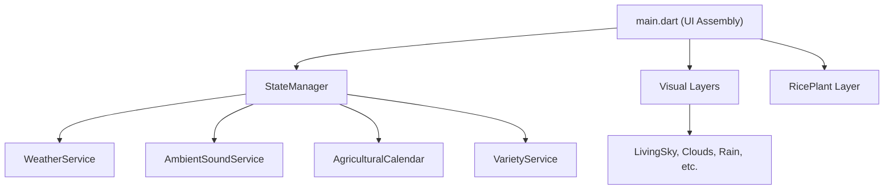

# Rice Journey (粒粒皆辛苦)

[🇹🇼 繁體中文](README.md) | [🇺🇸 English](README_en.md) | [🇯🇵 日本語](README_ja.md)

"One field a year, one story a season" — This is a real, quiet, companion app for Taiwan's local rice culture. No ads, no stamina mechanics, just a rice field that changes with time and real weather.
[](https://codinguniversefromeric.bobaboba.me)
[](https://testflight.apple.com/join/MpNSu2c8)
[](#)

## Tech Stack

- **Framework**: Flutter
- **State Management**: Native `setState` + `ChangeNotifier` (coordinated in `StateManager`)
- **Internationalization (i18n)**: Fully utilizes `.arb` files (e.g. `app_zh.arb`, `app_en.arb`, `app_ja.arb`) for strict language isolation and multi-language support.
- **Hardware & External Services**:
  - `geolocator`: Retrieves location to determine regional solar terms and rice varieties
  - `just_audio`: Ambient sound playback
  - **Weather API**: Dual-track system (uses CWA Open Data in Taiwan, Open-Meteo overseas) with global caching and silent fallback protection.

## Architecture

This project adopts a separation of concerns architecture to ensure high maintainability and performance:



- **`lib/services/`**: Pure business logic and API integrations, UI-independent. Includes state management, weather, location, solar calendar calculation, and ambient sounds.
- **`lib/visuals/`**: Independent visual layers. Each file handles a specific weather or atmospheric phenomenon like water ripples, fireflies, clouds, etc.
- **`lib/theme/`**: Centralized design system managing colors (`app_colors.dart`), constants (`animation_constants.dart`), and strings (`strings.dart`).
- **`lib/widgets/`**: Reusable UI components.
- **`lib/models/`**: Immutable data models and enums.

## Development & Build Commands

This project implements a robust dual-track weather API and fallback mechanism, meaning it can be run directly without configuring extra API keys.

### Run in Debug Mode
```bash
flutter run
```
*(In debug mode, if no CWA API Key is provided, the weather module will automatically and silently fall back to default sunny weather)*

### Run Tests
The project contains unit tests for the `services/` layer.
```bash
flutter test
```

### Code Quality & Linter
```bash
flutter analyze
```

## Developer Controls

In debug mode (`kDebugMode`), a hidden wrench icon appears in the top right corner. Click to open the control panel to:
- Instantly switch rice growth stages
- Change time of day and weather conditions
- Override battery levels
- Mock location (teleport)

This feature is automatically stripped from the UI tree when building for release (`flutter build ios` or `flutter build apk`).
