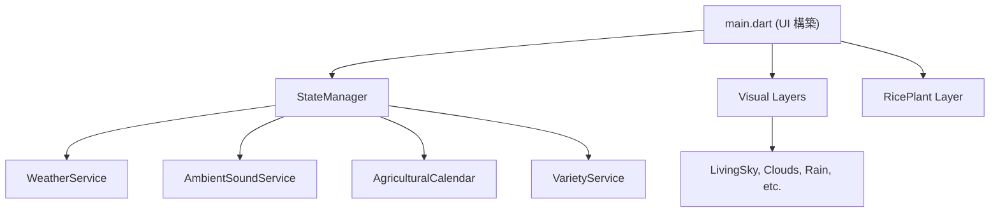

# Rice Journey (粒粒皆辛苦)

[🇹🇼 繁體中文](README.md) | [🇺🇸 English](README_en.md) | [🇯🇵 日本語](README_ja.md)

「一年に一つの田んぼ、一季に一つの物語」—— これは、台湾の稲作文化をテーマにしたリアルで静かな寄り添い型アプリです。広告やスタミナ制度はなく、時間と実際の天気とともに変化する田んぼがあるだけです。
[](https://codinguniversefromeric.bobaboba.me)
[](https://testflight.apple.com/join/MpNSu2c8)
[](#)

## 技術スタック (Tech Stack)

- **Framework**: Flutter
- **State Management**: ネイティブの `setState` + `ChangeNotifier` (`StateManager` で調整)
- **多言語対応 (i18n)**: `.arb` ファイル構成（例: `app_zh.arb`, `app_en.arb`, `app_ja.arb`）を全面的に採用し、厳密な言語分離と多言語対応を実現。
- **ハードウェアと外部サービス**:
  - `geolocator`: 位置情報を取得し、地域による二十四節気の違いや稲の品種を判断
  - `just_audio`: 環境音の再生
  - **天気 API**: デュアルトラックシステム（台湾国内では CWA Open Data、海外では Open-Meteo を使用）、グローバルキャッシュとサイレントフォールバック保護機能を搭載。

## アーキテクチャ (Architecture)

このプロジェクトは、高い保守性とパフォーマンスを確保するため、関心の分離（Separation of Concerns）アーキテクチャを採用しています：



- **`lib/services/`**: UI に依存しない純粋なビジネスロジックと API 連携。状態管理、天気、位置情報、二十四節気の計算、環境音を含みます。
- **`lib/visuals/`**: 独立した視覚レイヤー。各ファイルが水面の波紋、ホタル、雲など特定の天気や大気現象を担当します。
- **`lib/theme/`**: 色（`app_colors.dart`）、定数（`animation_constants.dart`）、文字列（`strings.dart`）を一元管理するデザインシステム。
- **`lib/widgets/`**: 再利用可能な UI コンポーネント。
- **`lib/models/`**: 不変 (Immutable) なデータモデルと列挙型。

## 開発とビルドコマンド

このプロジェクトは堅牢な天気 API デュアルトラックシステムとフォールバックメカニズムを実装しているため、追加の API キーを設定することなく直接実行できます。

### 開発モードで実行 (Debug)
```bash
flutter run
```
*(開発モードでは、CWA API キーが提供されていない場合、天気モジュールは自動的にデフォルトの晴天にサイレントフォールバックします)*

### テストの実行 (Tests)
プロジェクトには `services/` レイヤーの単体テストが含まれています。
```bash
flutter test
```

### コード品質と Linter
```bash
flutter analyze
```

## 開発者向けコントロール (Developer Controls)

開発モード (`kDebugMode`) では、画面右上に隠しアイコン（レンチ）が表示されます。クリックしてコントロールパネルを開くと、以下の操作が可能です：
- 稲の成長段階の即時切り替え
- 昼夜の時間帯と天候の変更
- バッテリー残量のオーバーライド
- 位置情報のモック（テレポート）

この機能は、リリースビルド (`flutter build ios` または `flutter build apk`) 時に UI ツリーから自動的に削除されます。
